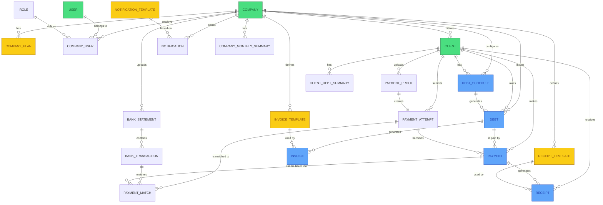

# Entities Relationship Diagram Overview

```mermaid
erDiagram
    COMPANY ||--o{ COMPANY_PLAN : "has"
    COMPANY ||--o{ COMPANY_USER : "employs"
    COMPANY ||--o{ CLIENT : "serves"
    COMPANY ||--o{ DEBT : "issues"
    COMPANY ||--o{ DEBT_SCHEDULE : "configures"
    COMPANY ||--o{ INVOICE_TEMPLATE : "defines"
    COMPANY ||--o{ RECEIPT_TEMPLATE : "defines"
    COMPANY ||--o{ BANK_STATEMENT : "uploads"
    COMPANY ||--o{ NOTIFICATION : "sends"

    USER ||--o{ COMPANY_USER : "belongs to"

    ROLE ||--o{ COMPANY_USER : "defines"

    CLIENT ||--o{ DEBT : "owes"
    CLIENT ||--o{ DEBT_SCHEDULE : "has"
    CLIENT ||--o{ PAYMENT_PROOF : "uploads"
    CLIENT ||--o{ PAYMENT_ATTEMPT : "submits"
    CLIENT ||--o{ PAYMENT : "makes"
    CLIENT ||--o{ RECEIPT : "receives"

    DEBT_SCHEDULE ||--o{ DEBT : "generates"

    DEBT ||--o{ INVOICE : "generates"
    DEBT ||--o{ PAYMENT : "is paid by"

    PAYMENT_PROOF ||--|| PAYMENT_ATTEMPT : "creates"

    PAYMENT_ATTEMPT ||--o{ PAYMENT : "becomes"
    PAYMENT_ATTEMPT ||--o{ PAYMENT_MATCH : "is matched to"

    BANK_STATEMENT ||--o{ BANK_TRANSACTION : "contains"

    BANK_TRANSACTION ||--o{ PAYMENT_MATCH : "matches"

    PAYMENT ||--o{ RECEIPT : "generates"
    PAYMENT ||--o{ PAYMENT_MATCH : "can be linked via"

    INVOICE_TEMPLATE ||--o{ INVOICE : "used by"
    RECEIPT_TEMPLATE ||--o{ RECEIPT : "used by"

    NOTIFICATION_TEMPLATE ||--o{ NOTIFICATION : "based on"

    %% Summary Tables
    CLIENT ||--o{ CLIENT_DEBT_SUMMARY : "has"
    COMPANY ||--o{ COMPANY_MONTHLY_SUMMARY : "has"

    classDef main fill:#4ade80,stroke:#166534,color:#166534
    classDef process fill:#60a5fa,stroke:#1e40af,color:#1e40af
    classDef config fill:#facc15,stroke:#854d0e,color:#854d0e

    class COMPANY,CLIENT,USER main
    class DEBT,DEBT_SCHEDULE,PAYMENT,INVOICE,RECEIPT process
    class INVOICE_TEMPLATE,RECEIPT_TEMPLATE,NOTIFICATION_TEMPLATE,COMPANY_PLAN config
```
