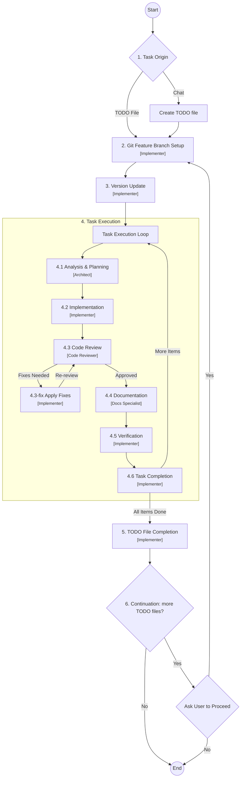

# @conciliador/entities — Conciliador de Pagos Entities Library

Central data model definitions (entities, enums, types) for the **Conciliador de Pagos** system — a multi-tenant SaaS for debt management and payment reconciliation. This package serves as the **Single Source of Truth (SSOT)** for all data models across the ecosystem.

**Attention AI Agents:** Before making any changes, you **must** read and adhere to the guidelines outlined in [`AGENTS.md`](AGENTS.md). This file contains critical information about the project's workflow, rules, and architectural standards.

## About

The primary goal of this repository is to provide a clean, structured, and authoritative source of truth for all data models in the Conciliador de Pagos platform.

By centralizing entity definitions in one versioned TypeScript package, we ensure consistency across:

- NestJS backend microservices
- Angular frontend applications
- Future services (mobile apps, scripts, etc.)

### Core Principles

- **TypeScript First** — All definitions are in modern TypeScript with strict mode.
- **Multi-Tenancy Ready** — Every major entity includes `companyId` for tenant isolation.
- **Audit & Soft Delete** — Standard audit fields (`createdAt`, `updatedAt`, `deletedAt`, `createdBy`, `updatedBy`) built into every entity.
- **Extensibility** — Entities are designed to be extended in consuming projects without modifying the library.
- **Consistency** — Clear naming conventions, detailed JSDoc comments, and organized barrel exports.

## Key Entities

Entities are organized by domain concern:

| Group | Entities |
|-------|----------|
| **Core & Multi-Tenancy** | `Company`, `CompanyPlan`, `User`, `Role`, `CompanyUser` |
| **Clients & Debts** | `Client`, `Debt`, `DebtSchedule` |
| **Invoicing & Templates** | `Invoice`, `InvoiceTemplate`, `Receipt`, `ReceiptTemplate` |
| **Payments & Reconciliation** | `PaymentProof`, `PaymentAttempt`, `Payment`, `BankStatement`, `BankTransaction`, `PaymentMatch` |
| **Communication & Summaries** | `Notification`, `NotificationTemplate`, `ClientDebtSummary`, `CompanyMonthlySummary` |

For full property definitions, see [`entities-definition.csv`](.agent/project-info/entities-definition.csv). For relationship diagrams, see [`entities-relationship-diagram-overview.md`](.agent/project-info/entities-relationship-diagram-overview.md).

## Tech Stack

| Technology | Purpose |
|------------|---------|
| **TypeScript** >= 5.x | Strict-mode type definitions |
| **Node.js** >= 20.x LTS | Build tooling runtime |
| **npm** >= 10.x | Package manager and publish tool |

Zero runtime dependencies. The library exports only TypeScript interfaces, types, and enums — no services, no side effects, no network calls.

## Project Structure

```text
src/
├── entities/          # Domain-organized entity interfaces
│   ├── company/
│   ├── client/
│   ├── debt/
│   ├── payment/
│   ├── bank/
│   ├── invoice/
│   ├── receipt/
│   ├── notification/
│   └── summary/
├── enums/             # Custom enums (e.g., DebtStatus, PaymentStatus)
├── types/             # Shared types (e.g., UUID, Money)
├── interfaces/        # Base interfaces (e.g., BaseEntity)
└── index.ts           # Root barrel export
```

## Installation & Usage

Install the package via npm:

```bash
npm install @conciliador/entities
```

Import directly into your project:

```typescript
import { Client, Debt, DebtStatus, Currency } from '@conciliador/entities';
```

The library exports only TypeScript interfaces, types, and enums — no runtime code, no side effects.

## Development Setup

```bash
# Clone the repository
git clone <repo-url>
cd entities

# Install dependencies
npm install

# Type-check without emitting
npx tsc --noEmit

# Build declarations and JS
npx tsc
```

Build outputs to `dist/` directory. When ready to publish:

```bash
npm publish --access public
```

## The Critical Workflow

The project follows a standardized process for task execution, ensuring systematic progress from analysis to deployment. Each step is handled by a dedicated sub-agent:



For full details, see [`critical-workflow.md`](.kilo/commands/critical-workflow.md).

## How to Start a Task

To initiate work with an AI agent, use one of the following copy-paste friendly commands in the chat.

### Option 1: Using a TODO File (Recommended)

1. Create a new file named `YYYYMMDD-todo-X.md` inside a date-specific subdirectory under `.agent/todos/` (e.g., `.agent/todos/20260602/20260602-todo-1.md`).
2. Populate it using one of the [recommended TODO file formats](docs/how-to-write-todo-files.md).
3. Paste the following into the chat:

```text
full read @AGENTS.md & follow /critical-workflow
do @/.agent/todos/<YYYYMMDD>/<YYYYMMDD>-todo-<number>.md
```

### Option 2: Direct Chat Request

If you have a quick request, use this template:

```text
full read @AGENTS.md & follow /critical-workflow
do [Your specific task or request here]
```

## AI Agent Plans

The critical workflow requires the AI to generate detailed implementation plans for each task. The [Architect sub-agent](.kilo/agents/architect.md) handles analysis and planning (step 4.1), while the [Implementer sub-agent](.kilo/agents/implementer.md) executes the plan (step 4.2). A [Code Reviewer](.kilo/agents/code-reviewer.md) validates quality, and a [Docs Specialist](.kilo/agents/docs-specialist.md) maintains documentation.

The AI agent will ask for your approval before proceeding with plans. To skip approval prompts, include in the TODO file or chat request:

```text
"Don't request me to approve plans"
```

## Related Documentation

- [`brief.md`](.agent/project-info/brief.md) — Core requirements, entity list, and project goals
- [`product.md`](.agent/project-info/product.md) — Product vision, target users, and key flows
- [`architecture.md`](.agent/project-info/architecture.md) — Design patterns, package structure, and naming conventions
- [`tech.md`](.agent/project-info/tech.md) — Technology stack, build workflow, and constraints
- [`data-model-brief.md`](.agent/project-info/data-model-brief.md) — Detailed entity definitions and roles
- [`entities-definition.csv`](.agent/project-info/entities-definition.csv) — Full property definitions for all entities
- [`entities-relationship-diagram-overview.md`](.agent/project-info/entities-relationship-diagram-overview.md) — Entity relationship diagrams

---

*Note: This workflow is actively maintained and updated to improve stability and introduce new features.*